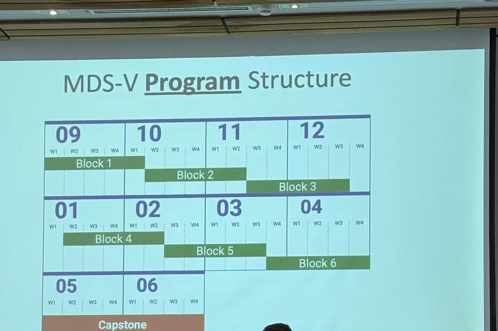

Orientation week was more helpful than I expected. It eased the feeling of being new here and gave me a clear overview of how the program is organized, so the weeks ahead feel less unknown.

Classes started quickly, and the timetable is full. The material has still felt practical so far: I can see how each piece is meant to be used, not just stored for an exam.

What surprised me most is how varied my classmates' backgrounds are. Many people already have full-time work experience, and that depth makes the cohort feel stronger. I am tired from the pace, but I am glad to be here.

